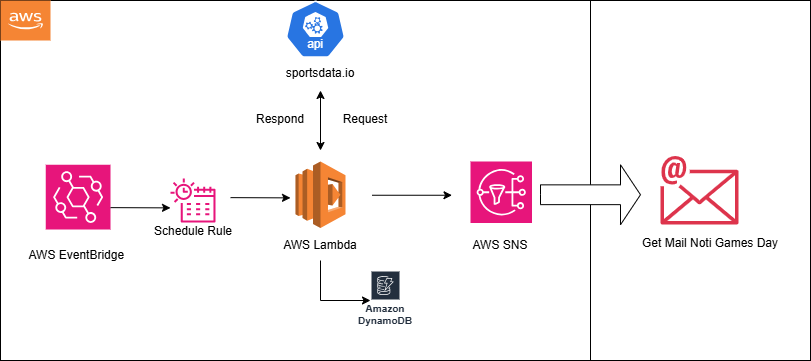

# Event-Driven-Notification-System

### 30 Days of DevOps - Project 2

This project is an **event-driven notification system** designed to send notifications based on real-time game schedules using **AWS Lambda**, **Amazon SNS (Simple Notification Service)**, **Amazon EventBridge**, and **Amazon DynamoDB**. The system fetches data from an external API, processes it using AWS Lambda, and sends notifications to subscribers based on the game status.

---

## Table of Contents
1. [Project Overview](#project-overview)
2. [Diagram of Game Days Alert](#diagram-of-game-days-alert)
3. [Setup Instructions](#setup-instructions)
    - [Clone the Repository](#1-clone-the-repository)
    - [Install Dependencies](#2-install-dependencies)
    - [Set Up the .env File](#3-set-up-the-env-file)
    - [Set Up the .gitignore File](#4-set-up-the-gitignore-file)
4. [Features](#features)
    - [AWS Lambda](#aws-lambda)
    - [Amazon SNS (Simple Notification Service)](#amazon-sns-simple-notification-service)
    - [Amazon EventBridge](#amazon-eventbridge)
    - [Amazon DynamoDB](#amazon-dynamodb)


---

## Project Overview

 The **NBA Game Notification System** keeps users updated about NBA games. It utilizes **AWS Lambda** for processing, **Amazon SNS** for sending notifications, **Amazon EventBridge** to schedule events, and **Amazon DynamoDB** for storing game data. It retrieves data from an external sportsdata.io API. The system works by fetching game data, formatting it, and sending timely updates to users via SNS.

---

### Diagram of Game Days Alert



## Setup Instructions

### 1. Clone the Repository

To get started, clone the repository to your local machine:

```bash
git clone https://github.com/Alexpeain/Event-Driven-Notification-System.git
cd Event-Driven-Notification-System
```
### 2. Install Dependencies

``` bash 
    pip install -r requirements.txt
```

### 3. Set Up the .env File

``` bash
AWS_ACCESS_KEY_ID=your_access_key_id
AWS_SECRET_ACCESS_KEY=your_secret_access_key
AWS_REGION=your_aws_region
SNS_TOPIC_ARN=arn:aws:sns:your-region:your-account-id:your-topic-name
NBA_API_KEY=your-api-key-here
DYNAMODB_TABLE_NAME=your_dynamodb_table_name

```
### 4. Set Up the .gitignore File
```bash 
# Python
__pycache__/
*.pyc
*.pyo
venv/

# Environment files
.env

# IDE configurations
.vscode/
.idea/

```
## Features

### AWS Lambda
AWS Lambda is used to run the code in response to events, such as changes in data or system state. It automatically manages the compute resources required by the code.

### Amazon SNS (Simple Notification Service)
Amazon SNS is used to send notifications to subscribers. It supports multiple protocols, including email, SMS, and HTTP/HTTPS endpoints.

### Amazon EventBridge
Amazon EventBridge is used to schedule events and trigger the AWS Lambda function at specified times. It allows for creating rules that match incoming events and route them to targets for processing.

### Amazon DynamoDB
Amazon DynamoDB is used to store game data. It is a fully managed NoSQL database service that provides fast and predictable performance with seamless scalability.
